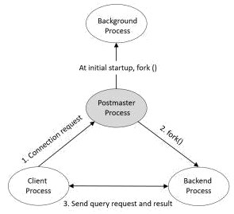

# PostgreSQl Architectural fundametals

PostgreSQL operates on a `client-server` model.

- `A server process`, which manages the databse files, accepts connections to the database from the client applications, and performs database connections on behalf of the clients. the database server program is called `postgres`.

- The user's `client (frontend)` application that wants to perform database operations.

  - Custome Application (Written in language such as `Python, Java, C++ and Node`).
  - Web Framework (`Django, Rails, etc.`).
  - SQL tools like `psql`, GUI clients, or ORMs (Object Relational Mappers).

The `client` and the `server` can be on different `hosts`. In that case they communicate over a `TCP/IP` network connection.

The `PostgreSQL` server can handle multiple concurrent connections from clients. To achieve this it starts `(“forks”)` a new process for each connection.

 

The `architecture` of `PostgreSQL` can be broken down into the following key components:

- Client Application.
- PostgreSQL Client Library(`libpq`).
- PostgreSQL Server Process.
- PostgreSQL BackgroundProcesses.
- Shared Memory and Buffer Cache.
- Disk Storage.

 

**`Client Application:`**

These are the external applications that interact with the PostgreSQL server to perform optrations like `querying, inserting, updating and deleting data`.

- Custome Application (Written in language such as `Python, Java, C++ and Node`).
- Web Framework (`Django, Rails, etc.`).
- SQL tools like `psql`, GUI clients, or ORMs (Object Relational Mappers).

`PostgreSQL client library (libpq):`

This is the low-level `C library` that provide communication between `client application` and the `PostgreSQL server`.

`libpq` is responsible for handling the `client-server communication`, packaging SQL commands into messages and seding/receiving responses.

`libpq` manages the following:

- Establishes a connection to the PostgreSQL server.
- Sends SQL queries from the client application to the server.
- Receives and processes responses (query results, error messages, etc).
- Manages connection pooling (if needed).

**`Shared Memory:`**

Shared memory refers to the memory reserved for the `database caching` and `transaction log caching`.

The most important elements in shared memory are

- Shared Buffer
- WAL buffers

`Shared Buffers:`

The purpose of `Shared Buffer` is to minimize `DISK IO`.

- You need to access very large (tens, hundreds of gigabytes) buffers quickly.
- You should minimize contention when many users access it at the same time.
- Frequently used blocks must be in the buffer for as long as possible.

Shared buffers play a crucial role i the performance and efficiency of PostgreSQL.
The shared buffer cache is a portion of memory allocated by PostgreSQL to cache blocks of data read from the disk. This caching is esseential for sevaral reasons:

- Reduce Disk I/O.
- Improve Performance.
- Support for Concurrent Access.
- Data Consistency and Integrity.
- Efficient Use of System Resources.

`WAL Buffer:`

The `WAL buffer` is a buffer that temporarily stores changes to the database.
the contents stored in the `WAL buffer` are written to the `WAL file` at a predetermined point in time.
From a backup and recovery point of view, WAL buffers and WAL files are very important.

**`PostgreSQL Process Types:`**

PostgreSQL has four process types:

- Postmaster (Daemon) process.
- Background process.
- Backend process.
- Client process.

`Postmaster Process (Main Server Process):`

Also known as `database server process` is the central process that starts when `PostgreSQL` is launched. It listens for incoming client connection on a specific IP address or Unix socket. this is the entry point for all client connections.

- The postmaster will listen on a TCP/IP socket or a Unix domain socket (if the connection is local).

- When a client connects, the postmaster spawns a new backend process to handle the request. The postmaster itself doesn’t execute SQL queries directly but manages connections, authentication, and spawning of worker processes.

- The `Postmaster` process is the first process started when you start `PostgreSQL`.
  At startup, performs `recovery`, initialize `shared memory`, and run `background processes`.

  It also creates a `backend process` when there is a connection request from the `client process`.

  - It listens for incomming connection

  

`Background Process:`

The list of background processes required for PostgreSQL operation are.

| Process             | Role                                                                                                                                                        |
| ------------------- | ----------------------------------------------------------------------------------------------------------------------------------------------------------- |
| logger              | Write the error message to the log file                                                                                                                     |
| checkpointer        | When a checkpoint occurs, the dirty buffer is written to the file                                                                                           |
| writer              | Periodically writes the dirty buffer to a file                                                                                                              |
| wal writer          | Write the WAL buffer to the WAL file                                                                                                                        |
| Autovacuum launcher | Fork autovacuum worker when autovacuum is enabled. It is the responsibility of the autovacuum daemon to carry vacuum operations on loated tables on demand. |
| archiver            | When in Archive.log mode, copy the WAL file to the specified directory.                                                                                     |
| stats collector     | DBMS usage statistics such as session execution information (pg_stat_activity) and table usage statistical information (pg_stat_all_tables) are collected.  |

**`Performance Metrics and Benchmarks:`**

`Maximum database size`: PostgreSQL can handle extremely large databases. The theoretical maximum database size is `32 TB` per database (with 64 bit systems), but practical limits are usually constrained by available hardware and storage.

- Maximum table size: 32 TB per table.
- Maximum row size: 1.6 TB per row.
- Maximum index size: 32 TB per index.
- Maximum number of columns per table: 1,600 columns.
- Maximum number of tables per schema: 4 billion tables (limited by OIDs, which are 32-bit identifiers).
