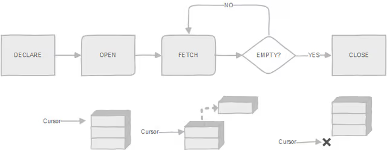

# Cursor

In PostgreSQL, a cursor is a database object that allow you to traverse the result set of a query one row at a time.

Cursor is usefull when you deal with large result sets or when you need to process rows sequentially.

**diagram:**


`Steps:`

- `First:` Declare the cursor.
- `Second:` Open the cursor.
- `Third:` Fetch rows from result set into a record or a variable list.
- `Fourth:` Process the fetched row and exit the loop, if there is no more row to fetch.
- `Finally:` Close the cursor.

`Declare cursor:`

```sql
-- syntax
DECLARE cursor_name CURSOR FOR  query;
```

`Open cursor:`

```sql
OPEN cursor_name;
```

`Fetching rows from the cursor:`

```sql

```
